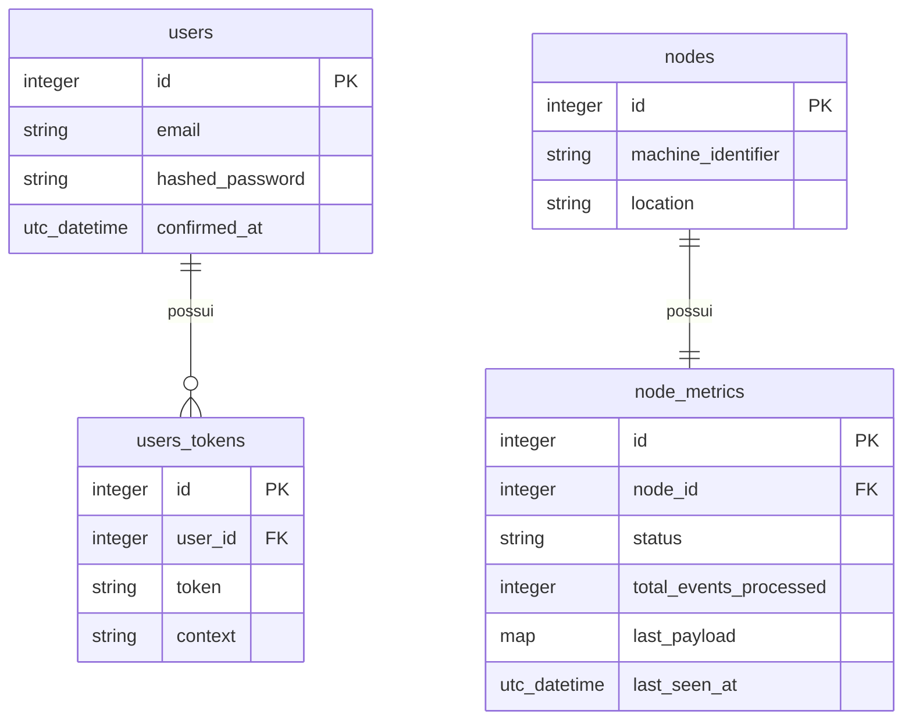

# Passo 1 — O Perímetro de Segurança (Fundação e Autenticação)

## O que foi implementado

- Projeto Phoenix 1.8.5 criado com SQLite (`ecto_sqlite3`), LiveView e sem mailer externo
- Autenticação gerada via `mix phx.gen.auth Accounts User users` (fluxo LiveView)
- Mailer local configurado com `Swoosh.Adapters.Local` e cliente HTTP desabilitado (`api_client: false`) — sem dependência de SMTP, adequado para ambiente edge
- Contexto `WCore.Telemetry` criado com seus schemas e migrations isolados do contexto `Accounts`

## Arquitetura atual
```
lib/w_core/
├── accounts/            # Gerado pelo phx.gen.auth
│   ├── user.ex          # Schema do operador
│   ├── user_token.ex    # Tokens de sessão
│   ├── user_notifier.ex # Notificações (local, sem SMTP)
│   └── scope.ex         # Escopo de autenticação
├── accounts.ex          # API pública do contexto Accounts
├── telemetry/
│   ├── node.ex          # Schema do sensor físico
│   └── node_metrics.ex  # Schema de métricas consolidadas
├── telemetry.ex         # API pública do contexto Telemetry (vazia por ora)
└── repo.ex              # Repositório Ecto (SQLite)

priv/repo/migrations/
├── ..._create_users_auth_tables.exs
├── ..._create_nodes.exs
└── ..._create_node_metrics.exs
```

## Diagrama de domínio


## Separação de contextos

| Contexto | Responsabilidade |
|---|---|
| `WCore.Accounts` | Autenticação e sessão dos operadores |
| `WCore.Telemetry` | Cadastro de sensores e métricas |

Os dois contextos são completamente isolados. O contexto `Telemetry` não conhece `Accounts` e vice-versa. A camada web (`WCoreWeb`) é a única que os conecta via router.

## Trade-offs e decisões

### SQLite com `pool_size: 1` — por que não Postgres ou Redis?

O desafio impõe SQLite como restrição de negócio (edge computing, sem dependências externas).
O problema concreto é que o SQLite usa locks em nível de arquivo — diferente do Postgres que
usa locks em nível de linha (MVCC). Isso significa que duas conexões tentando escrever ao
mesmo tempo causam `database is locked`.

**Alternativas consideradas:**

| Opção | Problema |
|---|---|
| `pool_size` padrão (10) | Múltiplas conexões disputam o lock → erro em desenvolvimento |
| WAL mode + pool maior | Funciona em produção, mas exige configuração extra do Exqlite |
| `pool_size: 1` | Serializa todas as escritas → zero contenção, custo: throughput de escrita sequencial |

Escolhi `pool_size: 1` em desenvolvimento porque elimina o problema sem configuração
adicional. Em produção, o Write-Behind do Passo 2 resolve o throughput: quem escreve no
banco é apenas um Worker assíncrono, não os sensores diretamente.

---

### Swoosh sem cliente HTTP — por que não simplesmente remover o mailer?

O `phx.gen.auth` gera código que referencia `WCore.Mailer` em vários lugares
(`user_notifier.ex`, testes). Remover o mailer exigiria editar arquivos gerados
manualmente, aumentando o risco de inconsistência.

**Alternativas consideradas:**

| Opção | Problema |
|---|---|
| Remover Swoosh completamente | Exige editar ~5 arquivos gerados, risco de quebrar o auth |
| Swoosh com adapter SMTP | Depende de servidor externo — inviável em edge sem internet |
| Swoosh com `Adapters.Local` + `api_client: false` | Mailer existe, compila, não tenta conectar a nada |

A opção escolhida mantém o contrato do código gerado intacto e deixa a porta aberta
para habilitar emails reais futuramente, apenas trocando o adapter na config.

---

### Duas tabelas para Telemetria — por que não uma tabela só?

Poderíamos ter uma tabela `nodes` com todos os campos de métricas junto. O problema
é que isso mistura dois ritmos de mudança completamente diferentes:

- `nodes.machine_identifier` e `nodes.location` mudam raramente (cadastro estático)
- `node_metrics.status` e `node_metrics.last_seen_at` mudam a cada poucos segundos

**Alternativas consideradas:**

| Opção | Problema |
|---|---|
| Tabela única `nodes` com campos de métrica | Upsert a cada pulso toca a linha inteira → lock desnecessário no cadastro |
| Tabela `node_metrics` separada | Upsert isolado, `UNIQUE(node_id)` garante exatamente uma métrica por nó |
| Tabela de eventos (append-only) | Crescimento ilimitado, consulta do estado atual exige agregação cara |

A separação permite que o Worker do Write-Behind faça `INSERT OR REPLACE` apenas
em `node_metrics`, sem tocar em `nodes`. Isso reduz a área de contenção do SQLite.

---

### `phx.gen.auth` com LiveView — por que não controllers puros?

O gerador oferece duas opções: LiveView ou Phoenix.Controller.

**Alternativas consideradas:**

| Opção | Problema |
|---|---|
| Controllers puros | Consistência quebrada — toda a app será LiveView, misturar paradigmas aumenta complexidade |
| LiveView | Fluxo de login/registro reativo, sem recarregamento de página, alinhado com o Passo 3 |

A escolha por LiveView garante que a experiência do operador seja uniforme do login
ao dashboard. Também significa que o `UserAuth` plug já está preparado para proteger
rotas LiveView via `on_mount`, que usaremos no Passo 3.