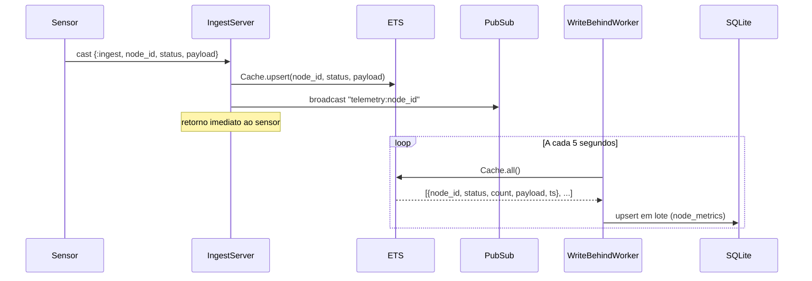

# Passo 2 — O Coração da Usina (Erlang OTP & ETS)

## O que foi implementado

- Tabela ETS `:w_core_telemetry_cache` para absorção de eventos em tempo real
- `IngestServer` (GenServer) como ponto de entrada único para pulsos dos sensores
- `WriteBehindWorker` (GenServer) para persistência assíncrona no SQLite a cada 5 segundos
- `WCore.Telemetry.Supervisor` orquestrando os três processos acima
- Broadcast via `Phoenix.PubSub` a cada evento recebido (base para o LiveView do Passo 3)

## Arquitetura atual
```
WCore.Application
└── WCore.Telemetry.Supervisor
    ├── WCore.Telemetry.Cache         (ETS — inicializado pelo Supervisor)
    ├── WCore.Telemetry.IngestServer  (GenServer — recebe pulsos, grava no ETS)
    └── WCore.Telemetry.WriteBehindWorker (GenServer — varre ETS, persiste no SQLite)
```

## Diagrama de fluxo


## Defesa do tipo de tabela ETS

### Por que `:set` e não `:bag` ou `:ordered_set`?

| Tipo | Comportamento | Adequação |
|---|---|---|
| `:set` | Uma entrada por chave, substituição automática | ✅ Ideal — queremos o estado mais recente por `node_id` |
| `:bag` | Múltiplas entradas por chave | ❌ Acumularia todos os eventos, memória ilimitada |
| `:ordered_set` | Como `:set` mas ordenado | ❌ Ordenação tem custo O(log n) desnecessário |
| `:duplicate_bag` | Como `:bag` sem restrição de duplicatas | ❌ Pior caso do `:bag` |

O `:set` garante que cada `node_id` tenha exatamente uma entrada — o último estado conhecido. Isso é exatamente o que queremos: não um histórico, mas um snapshot atual de cada sensor.

### Por que `:public` e não `:protected`?

| Acesso | Quem pode ler/escrever |
|---|---|
| `:private` | Apenas o processo dono |
| `:protected` | Dono escreve, todos leem |
| `:public` | Todos leem e escrevem |

Escolhemos `:public` porque tanto o `IngestServer` quanto o `WriteBehindWorker` precisam escrever e ler a tabela, e são processos diferentes. Com `:protected`, apenas o processo que criou a tabela poderia escrever — o que quebraria o design.

### Por que `read_concurrency: true`?

O LiveView do Passo 3 vai ler o ETS com alta frequência para montar o dashboard. `read_concurrency: true` otimiza o acesso de leitura paralela usando mecanismos internos do BEAM, sem custo adicional de escrita no nosso caso de uso.

## Defesa da estratégia de supervisão

### Por que `one_for_one`?

| Estratégia | Comportamento na falha |
|---|---|
| `one_for_one` | Reinicia apenas o processo que falhou |
| `one_for_all` | Reinicia todos os filhos |
| `rest_for_one` | Reinicia o que falhou e os subsequentes |

O `one_for_one` é correto aqui porque os processos são independentes em tempo de execução:

- Se o `WriteBehindWorker` falhar, o `IngestServer` continua recebendo eventos no ETS sem perda
- Se o `IngestServer` falhar, o `WriteBehindWorker` continua persistindo o que já está no ETS
- A tabela ETS pertence ao `Supervisor` (criada no `init/1`), então sobrevive à falha de qualquer filho

### Por que a tabela ETS é criada no Supervisor e não no Cache?

Se o `Cache` fosse um GenServer dono da tabela ETS, a tabela seria destruída junto com ele ao reiniciar. Criando a tabela no `Supervisor`, ela sobrevive à falha e reinício de qualquer filho — garantindo zero perda de dados em memória.

## Trade-offs e decisões

### `GenServer.cast` no IngestServer — por que não `call`?

| Opção | Comportamento | Custo |
|---|---|---|
| `cast` | Assíncrono — sensor não espera resposta | Sensor não sabe se falhou |
| `call` | Síncrono — sensor aguarda confirmação | Bloqueia o sensor até o GenServer responder |

Em missão crítica com milhares de sensores enviando pulsos a cada segundos, bloquear o sensor esperando confirmação criaria pressão de backpressure desnecessária. O ETS é tão rápido que a janela de falha silenciosa é negligenciável. Se precisarmos de garantia de entrega, implementamos um mecanismo de retry no sensor — não no servidor.

### Intervalo de 5 segundos no WriteBehindWorker — por que não menor?

O intervalo de 5 segundos é um balanço entre:

- **Consistência**: quanto menor o intervalo, mais próximo o SQLite fica do estado real
- **Throughput**: cada flush é uma transação no SQLite — intervalos muito curtos aumentam contenção
- **Tolerância a falha**: em caso de crash, perdemos no máximo 5 segundos de histórico consolidado (os eventos em si não são perdidos, apenas o contador acumulado)

Em produção, esse valor pode ser configurável via `Application.get_env/3`.