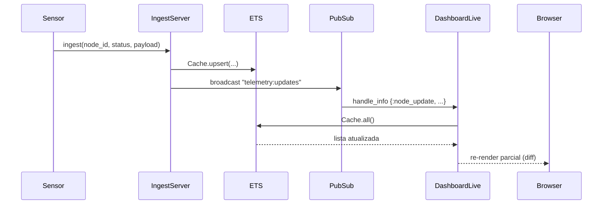

# Passo 3 — A Sala de Controle (Design System e LiveView)

## O que foi implementado

- Dashboard LiveView protegido por autenticação (`/dashboard`)
- Leitura dos dados quentes direto do ETS via `Cache.all()`
- Reatividade em tempo real via `Phoenix.PubSub` — o dashboard atualiza instantaneamente quando um sensor muda de status
- Design system próprio com componentes HEEx: `stat_card`, `node_card`, `status_badge`
- Fluxo de autenticação com email e senha (registro + login em português)

## Arquitetura atual
```
Browser (LiveView)
    │
    ├── mount/3 → Cache.all() → render inicial
    │
    └── handle_info {:node_update, ...}
            │
            └── Cache.all() → assign → re-render parcial
```

## Diagrama de fluxo PubSub


## Como evitamos gargalos no PubSub

### 1. Tópico único em vez de tópico por nó

| Abordagem | Problema |
|---|---|
| `"telemetry:#{node_id}"` (um tópico por sensor) | Com 1000 sensores, o LiveView precisaria subscrever 1000 tópicos no `mount` — overhead de memória e latência |
| `"telemetry:updates"` (tópico único) | Uma subscrição por LiveView, independente do número de sensores |

Escolhemos o tópico único. O tradeoff é que qualquer pulso aciona um re-render completo do dashboard, mas como a leitura é do ETS (sub-microsegundo), o custo é negligenciável.

### 2. Leitura do ETS no handle_info, não no broadcast

| Abordagem | Problema |
|---|---|
| Broadcast com payload completo | Mensagens grandes no PubSub, pressão de memória com muitos subscribers |
| Broadcast apenas com notificação + leitura local do ETS | Mensagem mínima no PubSub, cada LiveView lê seu próprio snapshot |

O `IngestServer` faz broadcast de apenas `{:node_update, node_id, status}` — uma tupla leve. O `DashboardLive` recebe a notificação e vai buscar o estado completo no ETS localmente. Isso elimina a duplicação de dados no barramento do PubSub.

### 3. Re-render parcial via LiveView diff

O Phoenix LiveView não reenvia o HTML completo a cada atualização — ele calcula o diff entre o estado anterior e o novo e envia apenas as mudanças. Isso significa que mesmo com 1000 sensores no dashboard, apenas os cards que mudaram de estado são atualizados no browser.

## Design System — componentes HEEx

Todos os componentes são funções privadas no próprio LiveView, sem dependências externas:

| Componente | Responsabilidade |
|---|---|
| `stat_card` | Exibe totais (sensores, ativos, alertas) |
| `node_card` | Card individual de cada sensor com status e métricas |
| `status_badge` | Badge colorida por status (Operacional, Crítico, Atenção) |

## Trade-offs e decisões

### Por que ler o ETS inteiro no handle_info em vez de atualizar apenas o nó afetado?

Com `Cache.all()` no `handle_info`, relemos todos os sensores a cada evento. A alternativa seria atualizar apenas o assign do nó específico que mudou.

A leitura completa do ETS é O(n) onde n é o número de sensores. Para a escala da Planta 42 (milhares de sensores), isso ainda é sub-milissegundo — o ETS é armazenamento em RAM com acesso direto. A simplicidade do código compensa o custo marginal.

### Por que autenticação com senha em vez de magic link?

O sistema roda em ambiente edge sem acesso a SMTP externo. Magic link exige entrega de email — inviável. A senha local é a única opção que funciona de forma autônoma na planta.

## Payload estruturado dos sensores

Cada pulso enviado por um sensor segue uma estrutura normalizada pelo `IngestServer`:
```elixir
%{
  temperatura: float(),  # °C  — calor do maquinário
  pressao:     float(),  # bar — pressão do sistema hidráulico/pneumático
  vibracao:    float(),  # mm/s — vibração mecânica (indica desgaste)
  rpm:         integer(),# rotações por minuto do motor
  voltagem:    float(),  # V — tensão elétrica
  corrente:    float()   # A — corrente elétrica
}
```

O `IngestServer` normaliza o payload via `normalizar_payload/1` antes de gravar no ETS, garantindo que campos ausentes recebam valores padrão (`0.0` ou `0`) em vez de causar erros no dashboard.

### Por que normalizar no IngestServer e não no dashboard?

| Abordagem | Problema |
|---|---|
| Normalizar no dashboard | Lógica de negócio vazando para a camada de apresentação |
| Normalizar no IngestServer | Dado já entra limpo no ETS — qualquer leitor (LiveView, testes) recebe estrutura garantida |

## Design dos cards no dashboard

Cada card de sensor exibe:

| Campo | Fonte | Observação |
|---|---|---|
| ID do sensor | `node_id` (ETS) | Identificador único |
| Status | `status` (ETS) | Colorido por criticidade |
| Temperatura | `payload.temperatura` | Destaque vermelho em status crítico |
| Pressão | `payload.pressao` | — |
| Vibração | `payload.vibracao` | Indica desgaste mecânico |
| RPM | `payload.rpm` | — |
| Voltagem | `payload.voltagem` | — |
| Corrente | `payload.corrente` | — |
| Total de eventos | `event_count` (ETS) | Contador acumulado |
| Último pulso | `timestamp` (ETS) | Data/hora do último evento recebido |

O campo temperatura recebe destaque visual (fundo vermelho) quando o status do nó é `"critical"`, reforçando a causa mais comum de falha crítica em maquinário industrial.