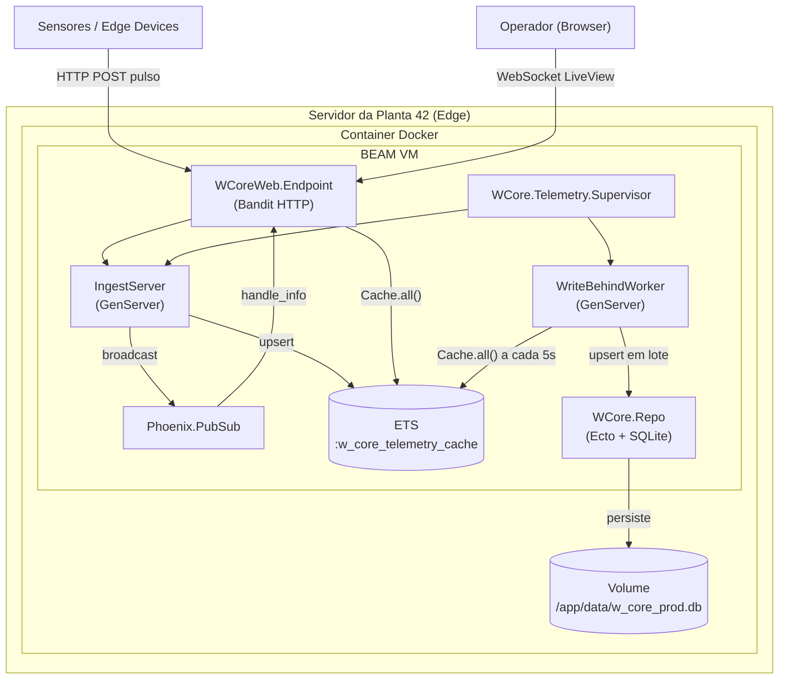

# Passo 5 — O Empacotamento para o Edge (Infraestrutura)

## O que foi implementado

- `Dockerfile` multi-estágio gerando uma mix release otimizada para produção
- `docker-compose.yml` com volume persistente para o banco SQLite
- `.env` para variáveis de ambiente sensíveis (fora do versionamento)
- `config/runtime.exs` ajustado para leitura de variáveis de ambiente em produção
- `config/prod.exs` com `server: true`, `check_origin: false` e sem `force_ssl`
- `pool_size: 1` garantido em produção para evitar contenção do SQLite
- `assets/js/app.js` corrigido — removida dependência de `phoenix-colocated` que causava falha do LiveSocket em produção

## Diagrama arquitetural — fluxo final


## Dockerfile — decisões de design

### Multi-estágio: builder + runtime
```
Estágio builder (elixir:1.19.5-otp-28-alpine)
    ├── Compila dependências
    ├── Compila assets (Tailwind + ESBuild)
    ├── Compila a aplicação
    └── Gera a mix release

Estágio runtime (elixir:1.19.5-otp-28-alpine)
    ├── Apenas libs de sistema necessárias (openssl, openssl-dev, ncurses)
    ├── Copia a release do builder
    └── Executa bin/w_core start
```

**Por que multi-estágio?**

| Opção | Tamanho estimado |
|---|---|
| Imagem única com Elixir + build tools | ~1.2 GB |
| Multi-estágio com Alpine runtime | ~150 MB |

### Por que o runtime usa a mesma imagem base do builder?

Inicialmente tentamos usar `alpine:3.21` puro no runtime, mas o OTP 28 foi compilado com OpenSSL 3.x e o Alpine 3.21 tem uma versão incompatível — causando erro `EVP_PKEY_sign_message_init: symbol not found` na inicialização da BEAM.

A solução foi usar `elixir:1.19.5-otp-28-alpine` também no runtime, garantindo compatibilidade de bibliotecas. O tradeoff é uma imagem ligeiramente maior, mas com zero risco de incompatibilidade de ABI.

### Problema com `phoenix-colocated` em produção

O Phoenix 1.8 introduziu suporte a hooks colocados (`phoenix-colocated`), que depende de symlinks para funcionar. No Windows e em containers Docker sem permissão, o symlink não é criado e o `app.js` compilado referenciava `colocatedHooks` como variável indefinida — quebrando o LiveSocket silenciosamente.

**Solução:** removemos a importação do `phoenix-colocated` do `app.js` já que não utilizamos hooks colocados no projeto.

## Variáveis de ambiente e segurança

As variáveis sensíveis são gerenciadas via arquivo `.env` (não versionado):

| Variável | Obrigatória | Descrição |
|---|---|---|
| `DATABASE_PATH` | ✅ | Caminho do arquivo SQLite |
| `SECRET_KEY_BASE` | ✅ | Chave de 64 chars para cookies/sessões |
| `PHX_HOST` | ✅ | Hostname do servidor (ex: `planta42.local`) |
| `PORT` | ❌ | Porta HTTP (padrão: `4000`) |

O `.env` está no `.gitignore` — nunca deve ser commitado. Em produção real, usar um gerenciador de segredos (Vault, AWS Secrets Manager) é recomendado.

## Volume do SQLite — por que é crítico

O SQLite armazena o banco em um único arquivo `.db`. Sem um volume Docker, o arquivo seria destruído junto com o container a cada restart.
```yaml
volumes:
  w_core_data:
    driver: local
```

O volume `w_core_data` é montado em `/app/data` dentro do container. Mesmo que o container seja recriado, o banco persiste no host.

**Caminho do banco em produção:** `/app/data/w_core_prod.db`

## Como fazer o deploy
```bash
# 1. Gerar SECRET_KEY_BASE
mix phx.gen.secret

# 2. Preencher o .env com as variáveis

# 3. Build e start
docker compose up --build -d

# 4. Criar primeiro usuário operador
docker compose exec w_core bin/w_core remote
# No console remoto:
# WCore.Accounts.register_user(%{email: "operador@planta42.com", password: "suasenha123"})

# 5. Verificar logs
docker compose logs -f
```

## Trade-offs e decisões

### Por que mix release em vez de rodar `mix phx.server` no container?

| Opção | Problema |
|---|---|
| `mix phx.server` no container | Exige Elixir instalado no runtime, container gigante, Mix não é adequado para produção |
| `mix release` | Release auto-contida, sem dependência de Elixir em runtime, inicialização mais rápida, migrations automáticas no boot |

### Por que `check_origin: false` em produção?

Em ambiente edge local, o servidor roda em `localhost` ou IP interno da planta. O `check_origin` padrão do Phoenix bloqueia conexões WebSocket de origens não listadas — o que quebra o LiveSocket quando acessado por IP em vez de hostname.

Para produção pública, o correto seria listar explicitamente as origens permitidas:
```elixir
check_origin: ["https://planta42.com", "https://www.planta42.com"]
```

### Por que não usar um banco externo em produção?

O desafio define explicitamente SQLite como restrição de negócio para edge computing. Em produção industrial, a ausência de dependências externas é uma vantagem — o sistema continua operando mesmo sem conectividade com servidores externos. O Write-Behind pattern garante que a carga de eventos não sobrecarrega o SQLite.